<div align="center">
  
</div>

<div align="center">
  <a href="https://www.linkedin.com/in/bahramkuranyi/"></a>
  <a href="https://github.com/Bahram-Kuranyi?tab=repositories"></a>
  
</div>

<br />

## I build software that turns ambitious ideas into working products.

I'm **Bahram Kuranyi**, a software engineer based in Germany with a **B.Sc. in Computer Engineering from Politecnico di Torino** and professional experience across frontend, backend, data, and product delivery. I care about strong product thinking, clean systems, and interfaces that feel effortless.

```ts
const bahram = {
  role: "Software Engineer",
  focus: ["Full-Stack Systems", "AI Products", "Developer Experience"],
  languages: ["English", "German", "Italian", "Persian"],
  currentlyBuilding: ["Personal Website", "Atlas", "Atlas AI"],
  principle: "Ship useful things. Learn fast. Raise the standard."
};
```

## Current focus

<table>
  <tr>
    <td width="33%" valign="top">
      <h3>01 · Engineering</h3>
      Building reliable web products with modern frontend, backend, testing, and deployment practices.
    </td>
    <td width="33%" valign="top">
      <h3>02 · AI & Data</h3>
      Exploring intelligent product workflows, applied machine learning, and human-centered AI experiences.
    </td>
    <td width="33%" valign="top">
      <h3>03 · Product</h3>
      Turning unclear problems into focused roadmaps, strong interfaces, and products people actually use.
    </td>
  </tr>
</table>

## Selected work

<table>
  <tr>
    <td width="50%" valign="top">
      <h3><a href="https://github.com/Bahram-Kuranyi/personal-website">Personal Website</a></h3>
      A high-end developer portfolio designed as a product experience—not a static CV.
      <br /><br />
      <code>Next.js</code> <code>TypeScript</code> <code>Tailwind CSS</code> <code>Motion</code>
    </td>
    <td width="50%" valign="top">
      <h3>Atlas App</h3>
      An AI-powered growth platform that turns goals into clear decisions, systems, and daily execution.
      <br /><br />
      <code>AI Product</code> <code>Full-Stack</code> <code>SaaS</code> <code>In development</code>
    </td>
  </tr>
  <tr>
    <td width="50%" valign="top">
      <h3>Atlas</h3>
      A global self-development brand connecting career, decision-making, learning, and meaningful growth.
      <br /><br />
      <code>Brand System</code> <code>Content Engine</code> <code>Community</code>
    </td>
    <td width="50%" valign="top">
      <h3><a href="https://github.com/Bahram-Kuranyi?tab=repositories">Engineering Lab</a></h3>
      A growing collection of software, data, machine-learning, and product experiments.
      <br /><br />
      <code>Python</code> <code>ML</code> <code>Data</code> <code>Open Source</code>
    </td>
  </tr>
</table>

## Engineering toolkit

<div align="center">
  
</div>

<br />

| Area | Skills and tools |
|---|---|
| **Frontend Engineering** | TypeScript, JavaScript, React, Next.js, Tailwind CSS, Redux, React Query, D3.js, Chart.js |
| **Backend & APIs** | Node.js, NestJS, Python, Django, Flask, Java, REST APIs, microservices |
| **Data & AI** | Python, SQL, PostgreSQL, MongoDB, TensorFlow, Keras, data analysis, applied machine learning |
| **Systems Foundations** | C, C++, algorithms, data structures, digital signal processing, MATLAB |
| **Quality & Delivery** | Git, Docker, Kubernetes, CI/CD, GitHub Actions, Jest, Cypress, code review, performance optimization |
| **Additional Experience** | Firebase, WordPress, Nuxt, Flutter, Agile delivery, technical project leadership |

## Engineering path

```text
2017 ── Web Development
2018 ── Frontend Engineering at scale
2020 ── Product & delivery leadership
2023 ── Full-Stack Software Engineering
Now  ── Building at the intersection of software, AI, and product
```

My experience spans user-facing platforms, data-rich dashboards, APIs, microservices, automated testing, CI/CD, and cross-functional product delivery—including engineering work at **Luxoft** and products serving more than one million users.

## GitHub signals

<div align="center">
  <picture>
    <source media="(prefers-color-scheme: dark)" srcset="https://github-readme-stats.vercel.app/api?username=Bahram-Kuranyi&show_icons=true&hide_border=true&bg_color=00000000&title_color=00C2FF&text_color=C9D1D9&icon_color=7C3AED&rank_icon=github" />
    <source media="(prefers-color-scheme: light)" srcset="https://github-readme-stats.vercel.app/api?username=Bahram-Kuranyi&show_icons=true&hide_border=true&bg_color=00000000&title_color=0366D6&text_color=24292F&icon_color=7C3AED&rank_icon=github" />
    
  </picture>
  <picture>
    <source media="(prefers-color-scheme: dark)" srcset="https://github-readme-stats.vercel.app/api/top-langs/?username=Bahram-Kuranyi&layout=compact&hide_border=true&bg_color=00000000&title_color=00C2FF&text_color=C9D1D9&langs_count=6" />
    <source media="(prefers-color-scheme: light)" srcset="https://github-readme-stats.vercel.app/api/top-langs/?username=Bahram-Kuranyi&layout=compact&hide_border=true&bg_color=00000000&title_color=0366D6&text_color=24292F&langs_count=6" />
    
  </picture>
</div>

<div align="center">
  
</div>

---

<div align="center">
  <h3>Let's build something ambitious.</h3>
  <p>I'm open to software engineering opportunities, product collaborations, and meaningful open-source work.</p>
  <a href="https://www.linkedin.com/in/bahramkuranyi/"><strong>Start a conversation →</strong></a>
</div>
